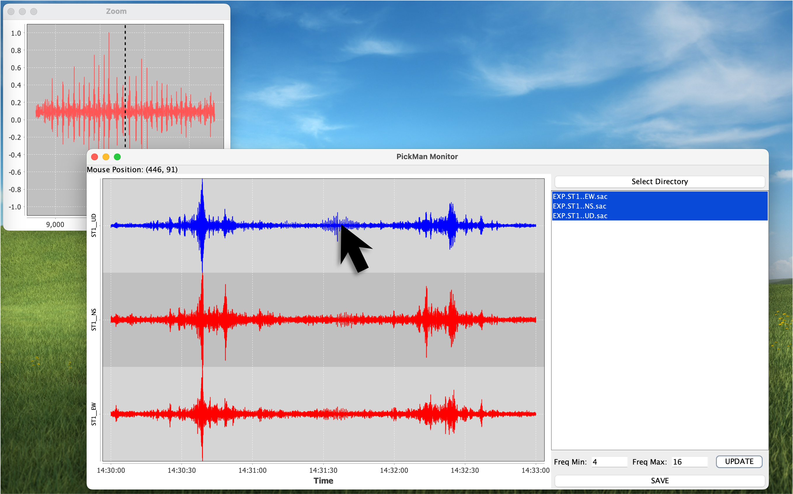

# Pickman for Java environment

Pickman is a simple GUI tool for picking seismic arrival times manually.

***Warning: This tool is under development.***

## Compile and run

If you have gradle installed, you can compile the project with:

```bash
gradle clean build
gradle fatJar
```

and run with:

```bash
java -jar build/libs/pickman-1.0-SNAPSHOT-all.jar
```

Also you can compile and run with maven:

```bash
mvn clean package
```

and run with:

```bash
java -jar target/pickman-1.0-SNAPSHOT-jar-with-dependencies.jar
```

## Usage

Click on the chart to select the arrival time.

- Left click: select the P-wave arrival time.
- Middle click: select the S-wave arrival time.
- Save button: save the selected arrival times to a NonLinLoc OBS file. See details [here](http://alomax.free.fr/nlloc/).



Example waveforms are in `210622.143000` directory.

## To be implemented

- [ ] Add test scripts
- [ ] Rough detection of the arrival time automatically
- [ ] Save other formats (e.g., pickfile in the WIN-system)

If you have any requests, please let me know.

## License

Licensed under the Apache License, Version 2.0 (the "License");
you may not use this file except in compliance with the License.
You may obtain a copy of the License at

    http://www.apache.org/licenses/LICENSE-2.0

Unless required by applicable law or agreed to in writing, software
distributed under the License is distributed on an "AS IS" BASIS,
WITHOUT WARRANTIES OR CONDITIONS OF ANY KIND, either express or implied.
See the License for the specific language governing permissions and
limitations under the License.

<p align="right">&copy; 2024 Minamoto</p>
